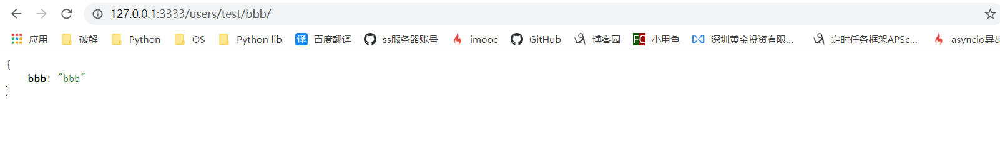
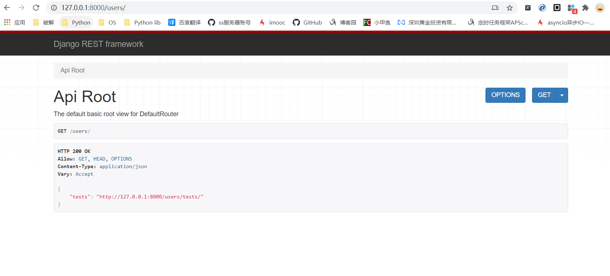
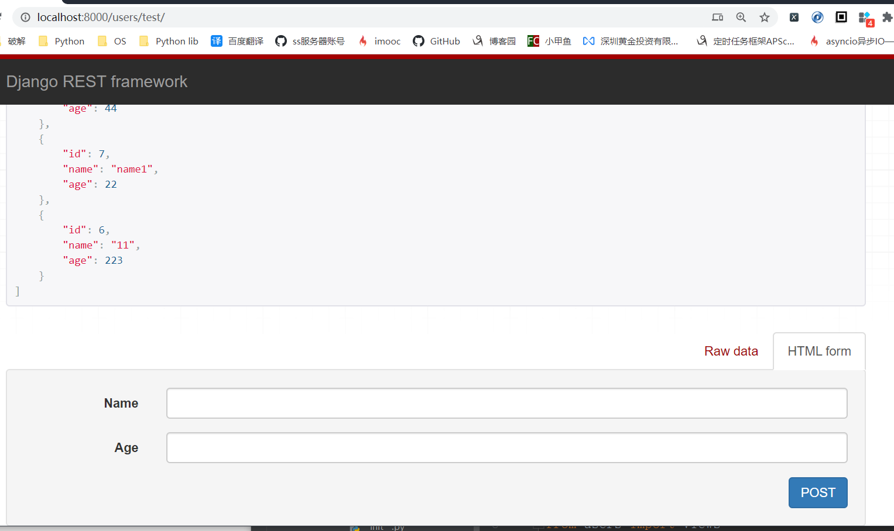
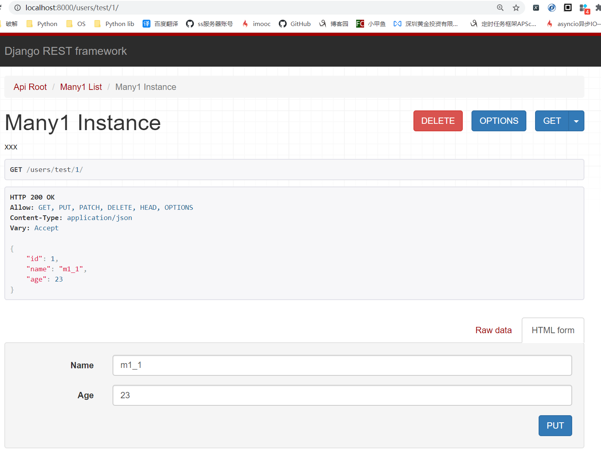
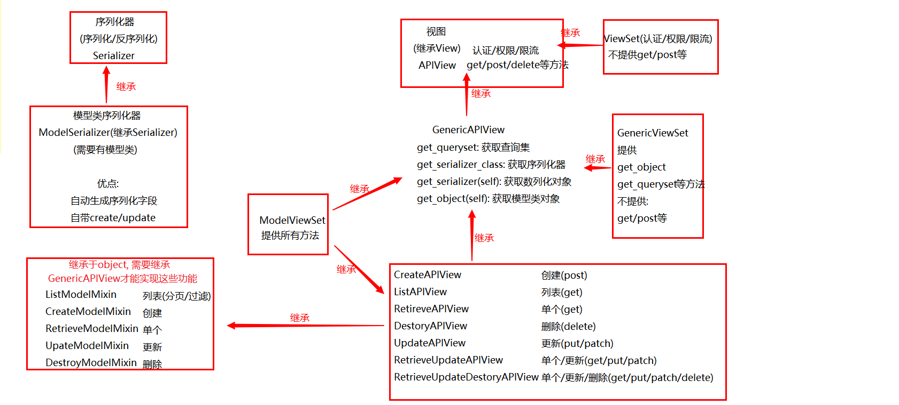

# 1. APIView

继承于`django.view`

## 1.1 新增方法

增加方法(限制方法见`REST-Limiter`):

* authentication_classes: list/tuple, 身份验证类
* permission_classes: list/tuple, 权限验证类
* throttle_classes: list/tuple, 流量控制类

## 1.2 Request

`rest-framework.view`中的`request`是经过封装后的, 所以参数如下

| 参数         | 数据类型 | 功能                                                         |
| ------------ | -------- | ------------------------------------------------------------ |
| data         | dict     | 1. 原django的`request`中的POST/FILES数据<br>2. POST/PUT/PATCH请求数据<br>3. JSON数据 |
| query_params | dict     | 和原`request`中的GET相同                                     |
|              |          |                                                              |


## 1.3 Response

`rest-framework.response`中只提供了一个响应对象. 使用之前需要配置前端渲染器, 来指定渲染类型

### 1.3.1 配置渲染器

```python
REST_FRAMEWORK = {
    'DEFAULT_RENDERER_CLASSES': (  # 默认响应渲染类
        'rest_framework.renderers.JSONRenderer',  # json渲染器
        'rest_framework.renderers.BrowsableAPIRenderer',  # 浏览API渲染器
    )
}
```

### 1.3.2 响应对象

```python
def __init__(self, data=None, status=None,
                 template_name=None, headers=None,
                 exception=False, content_type=None)
```

* data:

  Python内建数据类型, 需要传入的数据

* status:

  int, 响应码

* template_name:

  str, 模板名称

* headers:

  dict, 响应头部信息

* exception:

  bool, 出现异常是否当场抛出

* content_type:

  str, 响应信息中的`Content-Type`字段, 一般不用填, 框架会自动进行填写
  

常用参数

| 参数        | 类型               | 说明               |
| ----------- | ------------------ | ------------------ |
| data        | Python内建数据类型 | 传入的data         |
| status_code | int                | 响应码             |
| content     | bytes              | 经过渲染的响应数据 |
|             |                    |                    |
|             |                    |                    |
|             |                    |                    |


## 1.5 响应码

`REST-FrameWork`提供了常用响应码常量

| 响应码                                                       | 说明       |
| ------------------------------------------------------------ | ---------- |
| HTTP_100_CONTINUE<br>HTTP_101_SWITCHING_PROTOCOLS            | 信息告知   |
| HTTP_200_OK<br>HTTP_201_CREATED<br>HTTP_202_ACCEPTED<br>HTTP_203_NON_AUTHORITATIVE_INFORMATION<br>HTTP_204_NO_CONTENT<br>HTTP_205_RESET_CONTENT<br>HTTP_206_PARTIAL_CONTENT<br>HTTP_207_MULTI_STATUS | 处理成功   |
| HTTP_300_MULTIPLE_CHOICES<br>HTTP_301_MOVED_PERMANENTLY<br>HTTP_302_FOUND<br>HTTP_303_SEE_OTHER<br>HTTP_304_NOT_MODIFIED<br>HTTP_305_USE_PROXY<br>HTTP_306_RESERVED<br>HTTP_307_TEMPORARY_REDIRECT | 重定向     |
| HTTP_400_BAD_REQUEST<br>HTTP_401_UNAUTHORIZED<br>HTTP_402_PAYMENT_REQUIRED<br>HTTP_403_FORBIDDEN<br>HTTP_404_NOT_FOUND<br>HTTP_405_METHOD_NOT_ALLOWED<br>HTTP_406_NOT_ACCEPTABLE<br>HTTP_407_PROXY_AUTHENTICATION_REQUIRED<br>HTTP_408_REQUEST_TIMEOUT<br>HTTP_409_CONFLICT<br>HTTP_410_GONE<br>HTTP_411_LENGTH_REQUIRED<br>HTTP_412_PRECONDITION_FAILED<br>HTTP_413_REQUEST_ENTITY_TOO_LARGE<br>HTTP_414_REQUEST_URI_TOO_LONG<br>HTTP_415_UNSUPPORTED_MEDIA_TYPE<br>HTTP_416_REQUESTED_RANGE_NOT_SATISFIABLE<br>HTTP_417_EXPECTATION_FAILED<br>HTTP_422_UNPROCESSABLE_ENTITY<br>HTTP_423_LOCKED<br>HTTP_424_FAILED_DEPENDENCY<br>HTTP_428_PRECONDITION_REQUIRED<br>HTTP_429_TOO_MANY_REQUESTS<br>HTTP_431_REQUEST_HEADER_FIELDS_TOO_LARGE<br>HTTP_451_UNAVAILABLE_FOR_LEGAL_REASONS | 处理错误   |
| HTTP_500_INTERNAL_SERVER_ERROR<br>HTTP_501_NOT_IMPLEMENTED<br>HTTP_502_BAD_GATEWAY<br>HTTP_503_SERVICE_UNAVAILABLE<br>HTTP_504_GATEWAY_TIMEOUT<br>HTTP_505_HTTP_VERSION_NOT_SUPPORTED<br>HTTP_507_INSUFFICIENT_STORAGE<br>HTTP_511_NETWORK_AUTHENTICATION_REQUIRED | 服务器异常 |


  

## 1.4 使用实例: 

​	使用方法基本上和`django.view`没什么区别

* 视图

  ```python
  from rest_framework.views import APIView
  from rest_framework.response import Response
  
  
  from . import models, serializer
  
  
  class Many1View(APIView):
      """xxx"""
      def get(self, request):
          m1s = models.Many1.objects.all()
          ser = serializer.Many1Serializer(m1s, many=True)
          return Response(ser.data)
  ```

* 路由

  ```python
  from django.urls import path
  
  from users import views
  
  urlpatterns = [
      path(r"test/", views.Many1View.as_view())
  ]
  ```

  


# 2. GenericAPIView

继承于`rest-framework.APIView`, 增加方法如下

## 2.2 增加方法

* list数据
  * queryset: list, 指定list数据, 查询集
  * get_queryset(self): [object], 获取查询集
* 单一数据
  * lookup_url_kwarg: str, 指定url中提取的关键字参数名称, 默认等于`lookup_field`
  * lookup_field: str, 指定查询字段, 默认`pk`
  * get_object(self): object, 获取pk对应的ORM对象
* 序列化器
  * serializer_class: object, 指定序列化器类
  * get_serializer_class(self): object, 获取序列化器类
  * get_serializer(self, args, *kwargs): object, 获取序列化器对象
  * get_serializer_context(self): dict, 获取请求信息, 视图函数, 序列化执行类
* 查询集过滤器
  * filter_backends: str/object, 指定查询集的过滤器
  * filter_query(self, queryset): list, 获取过滤后的查询集

* 分页管理
  * pagination_class: str/object, 指定分页管理类
  * paginator: object, 获取当前分页对象
  * paginate_queryset(self, queryset): list, 返回当前页面的查询集
  * get_paginated_response(self, data): bytes, 返回一个渲染后发往前端以前的分页数据

## 2.2 使用实例

* 视图

  ```python
  from rest_framework.generics import GenericAPIView
  
  from . import models, serializer
  
  
  class Many1View(GenericAPIView):
      """xxx"""
      serializer_class = serializer.Many1Serializer
      queryset = models.Many1.objects.all()
  
      def get(self, request, pk=None):
          m = self.get_object()
          ser = self.get_serializer(m)
          return Response(ser.data)
  ```

* 路由

  此处要注意, django2.0后, path不能识别正则, 需要使用re_path

  ```python
  from django.urls import path, re_path
  
  urlpatterns = [
      re_path(r"test/(?P<pk>\d+)/", views.Many1View.as_view()),
  ]
  ```

  

# 3. Mixin

利用多继承特性, 来接入不同功能

## 3.1 ListModelMixin

提供list api的主要功能, 实现过滤, 分页功能

### 3.1.1 源码

```python
class ListModelMixin(object):
    """
    List a queryset.
    """
    def list(self, request, *args, **kwargs):
        queryset = self.filter_queryset(self.get_queryset())

        page = self.paginate_queryset(queryset)
        if page is not None:
            serializer = self.get_serializer(page, many=True)
            return self.get_paginated_response(serializer.data)

        serializer = self.get_serializer(queryset, many=True)
        return Response(serializer.data)
```

### 3.1.2 实例

* 视图

  ```python
  from rest_framework.generics import GenericAPIView
  from rest_framework.mixins import ListModelMixin
  
  
  from . import models, serializer
  
  
  class Many1View(GenericAPIView, ListModelMixin):
      """xxx"""
      serializer_class = serializer.Many1Serializer
      queryset = models.Many1.objects.all()
  
      def get(self, *args, **kwargs):
          return self.list(*args, **kwargs)
  ```

  

* 路由

  ```python
  from django.urls import path
  
  from users import views
  
  urlpatterns = [
      path(r"test/", views.Many1View.as_view()),
  ]
  
  ```

## 3.2 CreateModelMixin

用于创建对象的功能

### 3.2.1 源码

```python
class CreateModelMixin(object):
    """
    Create a model instance.
    """
    def create(self, request, *args, **kwargs):
        serializer = self.get_serializer(data=request.data)
        serializer.is_valid(raise_exception=True)
        self.perform_create(serializer)
        headers = self.get_success_headers(serializer.data)
        return Response(serializer.data, status=status.HTTP_201_CREATED, headers=headers)

    def perform_create(self, serializer):
        serializer.save()

    def get_success_headers(self, data):
        try:
            return {'Location': str(data[api_settings.URL_FIELD_NAME])}
        except (TypeError, KeyError):
            return {}
```

### 3.2.2 实例

* 视图

  ```python
  from rest_framework.generics import GenericAPIView
  from rest_framework.mixins import ListModelMixin, CreateModelMixin
  
  
  from . import models, serializer
  
  
  class Many1View(GenericAPIView, ListModelMixin, CreateModelMixin):
      """xxx"""
      serializer_class = serializer.Many1Serializer
      queryset = models.Many1.objects.all()
  
      def get(self, *args, **kwargs):
          return self.list(*args, **kwargs)
  
      def post(self, *args, **kwargs):
          return self.create(*args, **kwargs)
  ```

  

* 路由

  ```python
  from django.urls import path
  
  from users import views
  
  urlpatterns = [
      path(r"test/", views.Many1View.as_view()),
  ]
  ```

## 3.3 RetrieveModelMixin

详情信息功能

### 3.3.1 源码

```python
class RetrieveModelMixin:
    """
    Retrieve a model instance.
    """
    def retrieve(self, request, *args, **kwargs):
        instance = self.get_object()
        serializer = self.get_serializer(instance)
        return Response(serializer.data)
```


### 3.3.2 实例

* 视图

  ```python
  from rest_framework.generics import GenericAPIView
  from rest_framework.mixins import ListModelMixin, CreateModelMixin, RetrieveModelMixin
  
  from . import models, serializer
  
  
  class Many1View(GenericAPIView, ListModelMixin, CreateModelMixin, RetrieveModelMixin):
      """xxx"""
      serializer_class = serializer.Many1Serializer
      queryset = models.Many1.objects.all()
  
      def get(self, request, pk=None, *args, **kwargs):
          print(pk)
          print(args, kwargs)
          if pk is None:
              return self.list(request, *args, **kwargs)
          else:
              return self.retrieve(request, pk, *args, **kwargs)
  
      def post(self, *args, **kwargs):
          return self.create(*args, **kwargs)
  ```

  

* 路由

  ```python
  from django.urls import re_path
  
  from users import views
  
  urlpatterns = [
      re_path(r"test/(?:(?P<pk>\d+)/)?", views.Many1View.as_view()),
  ]
  
  ```

## 3.4 UpdateModelMixin

更新视图相关

### 3.4.1 源码

```python
class UpdateModelMixin:
    """
    Update a model instance.
    """
    def update(self, request, *args, **kwargs):
        partial = kwargs.pop('partial', False)
        instance = self.get_object()
        serializer = self.get_serializer(instance, data=request.data, partial=partial)
        serializer.is_valid(raise_exception=True)
        self.perform_update(serializer)

        if getattr(instance, '_prefetched_objects_cache', None):
            # If 'prefetch_related' has been applied to a queryset, we need to
            # forcibly invalidate the prefetch cache on the instance.
            instance._prefetched_objects_cache = {}

        return Response(serializer.data)

    def perform_update(self, serializer):
        serializer.save()

    def partial_update(self, request, *args, **kwargs):
        kwargs['partial'] = True
        return self.update(request, *args, **kwargs)
```


### 2.4.2 示例

* 视图

  ```python
  from rest_framework.generics import GenericAPIView
  from rest_framework.mixins import ListModelMixin, CreateModelMixin, RetrieveModelMixin, UpdateModelMixin
  
  from . import models, serializer
  
  
  class Many1View(GenericAPIView, ListModelMixin, CreateModelMixin, RetrieveModelMixin, UpdateModelMixin):
      """xxx"""
      serializer_class = serializer.Many1Serializer
      queryset = models.Many1.objects.all()
  
      def get(self, request, pk=None, *args, **kwargs):
          print(pk)
          print(args, kwargs)
          if pk is None:
              return self.list(request, *args, **kwargs)
          else:
              return self.retrieve(request, pk, *args, **kwargs)
  
      def post(self, *args, **kwargs):
          return self.create(*args, **kwargs)
  
      def put(self, *args, **kwargs):
          return self.update(*args, **kwargs)
  ```

  

* 路由

  ```python
  from django.urls import re_path
  
  from users import views
  
  urlpatterns = [
      re_path(r"test/(?:(?P<pk>\d+)/)?", views.Many1View.as_view()),
  ]
  ```

  

## 3.5 DestroyModelMinxin

删除相关

### 3.5.1 源码

```python
class DestroyModelMixin:
    """
    Destroy a model instance.
    """
    def destroy(self, request, *args, **kwargs):
        instance = self.get_object()
        self.perform_destroy(instance)
        return Response(status=status.HTTP_204_NO_CONTENT)

    def perform_destroy(self, instance):
        instance.delete()

```

### 3.5.2 示例

* 视图

  ```python
  from rest_framework.generics import GenericAPIView
  from rest_framework.mixins import ListModelMixin, CreateModelMixin, RetrieveModelMixin, UpdateModelMixin, \
      DestroyModelMixin
  
  from . import models, serializer
  
  
  class Many1View(GenericAPIView, ListModelMixin, CreateModelMixin, RetrieveModelMixin, UpdateModelMixin,
                  DestroyModelMixin):
      """xxx"""
      serializer_class = serializer.Many1Serializer
      queryset = models.Many1.objects.all()
  
      def get(self, request, pk=None, *args, **kwargs):
          print(pk)
          print(args, kwargs)
          if pk is None:
              return self.list(request, *args, **kwargs)
          else:
              return self.retrieve(request, pk, *args, **kwargs)
  
      def post(self, *args, **kwargs):
          return self.create(*args, **kwargs)
  
      def put(self, *args, **kwargs):
          return self.update(*args, **kwargs)
  
      def delete(self, *args, **kwargs):
          return self.destroy(*args, **kwargs)
  ```

  

* 路由

  ```python
  from django.urls import re_path
  
  from users import views
  
  urlpatterns = [
      re_path(r"test/(?:(?P<pk>\d+)/)?", views.Many1View.as_view()),
  ]
  ```

# 4. 视图APIView

封装的高级视图函数如下

| 视图类                       | 提供方法                      | 继承关系                                                     |
| ---------------------------- | ----------------------------- | ------------------------------------------------------------ |
| CreateAPIView                | POST                          | GenericAPIView<br>CreateModelMixin                           |
| ListAPIView                  | GET                           | GenericAPIView<br>ListModelMixin                             |
| RetireveAPIView              | GET                           | GenericAPIView<br/>RetrieveModelMixin                        |
| DestoryAPIView               | DELETE                        | GenericAPIView<br/>DestoryModelMixin                         |
| UpdateAPIView                | GET<br>PUT                    | GenericAPIView<br>UpdateModelMixin                           |
| RetrieveUpdateAPIView        | GET<br>PUT<br>PATCH           | GenericAPIView<br>RetrieveModelMixin<br>UpdateModelMixin     |
| RetrieveUpdateDestoryAPIView | GET<br>PUT<br>PATCH<br>DELETE | GenericAPIView<br>RetrieveModelMixin<br>UpdateModelMixin<br>DestoryModelMixin |


# 5. 视图集

视图集, 将GET/POST等动词利用mapping + url等方式映射为`list`, `retrieve`, `create`, `update`, `destory`

所以定义ViewSet需要使用:

* list
* retrieve
* create
* update
* destory

不能使用GET等动词, 每次用户访问, 我们都可以通过`self.action`来确定是以上动词的哪个

```python
create_request = True if self.action == 'create' else False
```


## 5.1 GenericViewSet

继承`GenericAPIView, ViewSetMinxin`

* `ViewSetMinxin`主要用于GET等动词转换
* `GenericAPIView` 主要用于请求分发等操作

## 5.2 ViewSet

### 5.2.1 常规使用方法

继承于`ViewSetMixin, views.APIView`, 增加了身份验证, 权限校验, 流量管理等. 视图集基类不提供action方法, 需要自己实现

* 视图

  ```python
  class Many2ViewSet(ViewSet, GenericViewSet):
      """xxx"""
      queryset = models.Many2.objects.all()
  
      serializer_class = serializer.Many1Serializer
  
      def list(self, request, *args, **kwargs):
          queryset = self.filter_queryset(self.get_queryset())
  
          page = self.paginate_queryset(queryset)
          if page is not None:
              serializer = self.get_serializer(page, many=True)
              return self.get_paginated_response(serializer.data)
  
          serializer = self.get_serializer(queryset, many=True)
          return Response(serializer.data)
      
      def post(self, *args, **kwargs):
          pass
      ...
  ```

* 路由

  ```python
  from rest_framework.routers import DefaultRouter
  
  from users import views
  
  urlpatterns = [
  ]
  
  router = DefaultRouter()
  router.register(prefix=r"tests", viewset=views.Many2ViewSet)
  urlpatterns += router.urls
  ```


### 5.2.2 拓展action

* 视图函数

  ```bash
  class Many1ViewSet(ModelViewSet):
      """xxx"""
      serializer_class = serializer.Many1Serializer
      queryset = models.Many1.objects.all()
      # authentication_classes = (SessionAuthentication, BasicAuthentication)
  
      @action(methods=["GET"], detail=True)  # 只允许get请求, 访问详情页面
      def aaa(self, request, pk):
          print(pk)
          return JsonResponse({"aaa": "aaa"})
  
      @action(methods=["GET"], detail=False)  # 只允许get请求, 访问list页面
      def bbb(self, request):
          return JsonResponse({"bbb": "bbb"})
  ```

* 路由

  ```bash
  from rest_framework.routers import DefaultRouter
  
  from users import views
  
  urlpatterns = [
  ]
  
  router1 = DefaultRouter()
  router1.register(prefix=r"test", viewset=views.Many1ViewSet)
  urlpatterns = urlpatterns + router1.urls
  
  ```

* 页面效果

  url1: /users/test/1/aaa/

  url2: /users/test/bbb/ 

  

## 5.3 常用视图集

### 5.3.1 视图集

以下视图集均继承与GenericViewSet, ViewSetMinxin

| 视图集               | 支持action                 |
| -------------------- | -------------------------- |
| ReadOnlyModelViewSet | 支持list/单个查询          |
| ModelViewSet         | 创建/查询(单/多)/更新/删除 |

### 5.3.2 路由配置

#### 5.3.2.1 SimpleRouter

| URL                           | 请求方式             | Action                                 | url-name              |
| ----------------------------- | -------------------- | -------------------------------------- | --------------------- |
| {prefix}/                     | GET/POST             | list/create                            | {basename}-list       |
| {prefix}/{url_path}/          | 指定方法             | 指定action                             | {basename}-{url_path} |
| {prefix}/{lookup}/            | GET/PUT/PATCH/DELETE | retrieve/update/partial_update/destroy | {basename}-detail     |
| {prefix}/{lookup}/{url_path}/ | 指定方法             | 指定action                             | {basename}-{url_path} |


#### 5.3.2.2 DefaultRouter

DefaultRouter会多附带一个默认的API根视图，返回一个包含所有列表视图的超链接响应数据。

| URL                                    | 请求方式             | Action                                 | url-name              |
| -------------------------------------- | -------------------- | -------------------------------------- | --------------------- |
| {.format}/                             | GET                  | 自动生成的root-view                    | api-root              |
| {prefix}/{.format}                     | GET/POST             | list/create                            | {basename}-list       |
| {prefix}/{url_path}/{.format}          | 指定方法             | 指定action                             | {basename}-{url_path} |
| {prefix}/{lookup}/{.format}            | GET/PUT/PATCH/DELETE | retrieve/update/partial_update/destroy | {basename}-detail     |
| {prefix}/{lookup}/{url_path}/{.format} | 指定方法             | 指定action                             | {basename}-{url_path} |

**api-root示例**



### 5.3.3 实例

* 视图

  ```python
  from rest_framework.viewsets import ModelViewSet
  
  from . import models, serializer
  
  class Many1ViewSet(ModelViewSet):
      """xxx"""
      serializer_class = serializer.Many1Serializer
      queryset = models.Many1.objects.all()
  ```

* 路由

  ```python
  router = DefaultRouter()
  router.register(prefix=r"test", viewset=views.Many1ViewSet)
  urlpatterns = router.urls
  ```

* 效果

  1. /test/

     

  2. /test/1

     

# 6. rest-framework继承关系图



